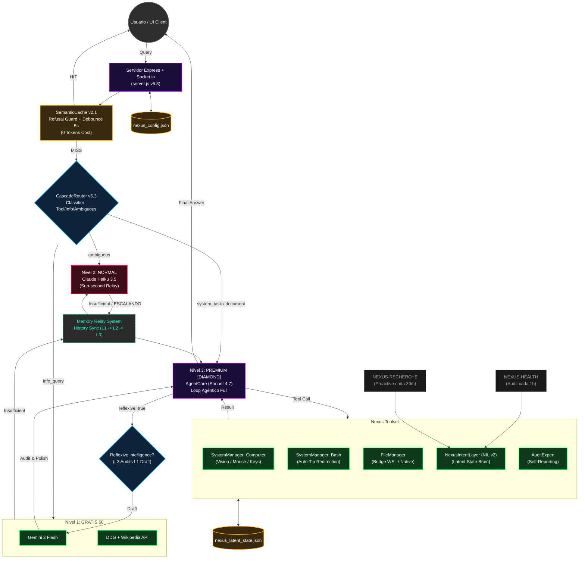

# Diagrama de Flujo: ASA NEXUS (v6.3 TRINITY-PATH)
**Fecha de Actualización:** 02 de Abril de 2026  
**Arquitectura:** Modular Desacoplada + Memory Relay + Reflexive Intelligence + NIL v2

---

## Arquitectura General (v6.3)

---

## Detalle de Niveles (v6.3)

### Nivel 0: Semantic Cache (Inteligencia Latente)
- **Función:** Interceptar queries idénticas o semánticamente similares.
- **Ventaja:** Latencia < 50ms y coste $0 tokens.
- **Filtros:** Incluye **Refusal Guard** para evitar loops de error cacheados.

### Nivel 1: Free Tier (Gemini Flash Parallel)
- **Motores:** Gemini 3 Flash + DuckDuckGo + Wikipedia.
- **Lógica:** Ejecución en paralelo. Si Gemini falla, Wikipedia/DDG sirven de backup instantáneo.
- **Uso:** Consultas rápidas, definiciones y cultura general.

### Nivel 2: Normal Tier (Haiku Relay)
- **Modelo:** Claude Haiku 3.5.
- **Relay:** Sistema de fallback automático si el endpoint principal de Haiku falla.
- **Escalado:** Si detecta que la tarea requiere herramientas (bash, edit), emite la señal `ESCALANDO_A_PREMIUM`.

### Nivel 3: Premium Tier (Diamond Core)
- **Modelo:** Claude Sonnet 4.7.
- **Capacidades:** Control total del sistema, edición de archivos, visión (computer use).
- **Inteligencia Reflexiva:** Sonnet usa a Gemini como "primer borrador" para optimizar sus propios pasos de pensamiento, reduciendo alucinaciones en acceso local.

---

## Cambios Clave v6.3 (Memory Relay Edition)

| Componente | Innovación v6.3 | Impacto |
|---|---|---|
| **Memory Relay** | El historial se persiste entre niveles de escalado. | L3 sabe exactamente qué intentó L1 y L2 antes de fallar. |
| **Reflexive Intelligence** | Sonnet audita borradores de Gemini Flash. | Respuestas más rápidas y certeras en tareas complejas. |
| **Bash v2** | Redirección de errores con [NEXUS-TIP]. | Sugiere usar 'computer screenshot' cuando falla un comando ciego. |
| **NIL v2 (Brain)** | Estado Latente JSON puro. | Eliminación total de dependencias SQLite; portabilidad máxima. |
| **Auto-Recovery** | Guardrails en `uncaughtException`. | El servidor sobrevive a fallos críticos de herramientas externas. |
| **Haiku 3.5 Relay** | Fallback entre versiones de Haiku (4.5 -> 3). | Garantiza disponibilidad continua del Nivel 2. |

---

### [SISTEMA OPTIMIZADO - ASA NEXUS v6.3 - TRINITY PATH]
